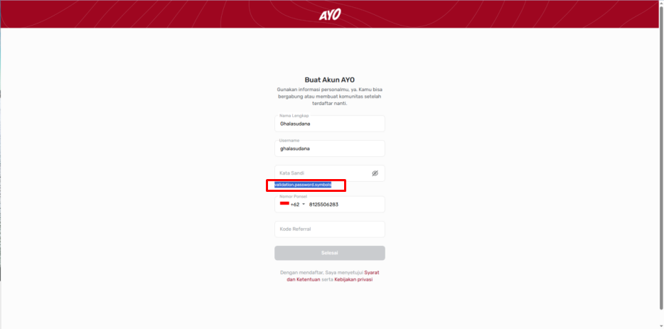
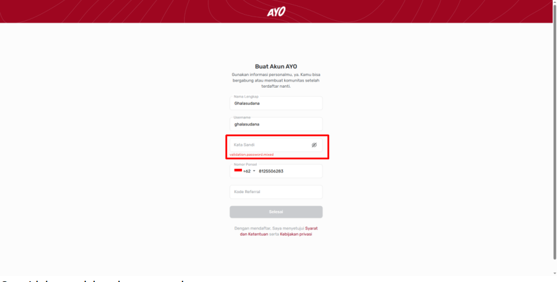
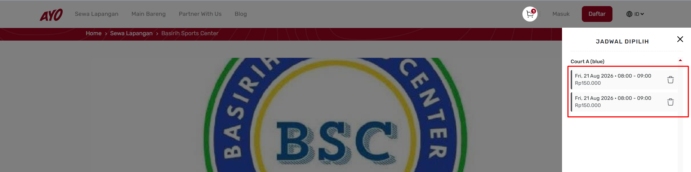

# 📝 Studi Kasus 2

---

## 1. Pengujian Web AYO (https://ayo.co.id)

### 1. Registrasi Akun Baru (Sign Up)

#### A. Fitur / Area Pengujian:
* **Fitur Registrasi Akun Baru (Sign Up)**

#### B. Mekanisme Pengujian:
* **UI Testing (Exploratory Testing)** & **UI Automation (Cypress)**

#### C. Alasan Pengujian:
Fitur **Sign Up** adalah pintu masuk utama pengguna. Pengujian UI secara mendalam pada alur ini krusial dilakukan karena **ditemukan bug minor** saat pengujian:

* **Temuan Defect:** Saat menginput password, sistem menampilkan teks error: `validation.password.symbol` dan `validation.password.mixed`.
* **Dampak:** Membingungkan calon pengguna, karena pesan validasi tidak menjelaskan kriteria password yang belum terpenuhi.
* **Ekspektasi:** Menampilkan pesan yang ramah pengguna, contoh: *"Kata sandi harus terdiri dari minimal 1 karakter simbol dan kombinasi huruf besar-kecil"*.

---

### 2. Checkout & Produk Tambahan (Add-Ons)

#### A. Fitur / Area Pengujian:
* **Halaman Checkout & Opsi Produk Tambahan (Add-Ons Flow)**

#### B. Mekanisme Pengujian:
* **UI Testing (Exploratory Testing)** & **UI Automation (Cypress)**

#### C. Alasan Pengujian:
Pengujian pada halaman checkout/opsi produk tambahan krusial karena **ditemukan bug kalkulasi nilai pembayaran pada kondisi pengguna belum login**:

* **Temuan Defect:** Pada halaman pilihan Produk Tambahan (Opsional), nominal **Total Bayar reset menjadi 0** saat field/dropdown tersebut diklik. Bug ini spesifik terjadi apabila pengguna melakukan booking tanpa/belum melakukan *login*.
* **Dampak:** *Major Impact* pada alur transaksi. Mengakibatkan ketidaksesuaian data kalkulasi harga (*price mismatch*) serta membingungkan pengguna sebelum berpindah ke tahap pembayaran.
* **Ekspektasi:** Total Bayar harus tetap mempertahankan akumulasi harga sewa lapangan dari alur sebelumnya (meskipun user belum login), dan baru bertambah jika pengguna memilih item produk tambahan.

---

### 3. Sistem Booking & Pengelolaan Slot Keranjang (Booking Cart Validation)

#### A. Fitur / Area Pengujian:
* **Fitur Pemilihan Venue & Checkout (Cart & Slot Selection)**

#### B. Mekanisme Pengujian:
* **UI Testing**, **UI Automation (Cypress)**, & **API Testing**

#### C. Alasan Pengujian (Based on Real Defect Finding):
Pengujian pada sistem booking krusial dilakukan karena **ditemukan bug kritis terkait validasi slot dan logika penghapusan keranjang**:

1. **Bug Double Booking:**
   * **Temuan Defect:** Pengguna yang belum melakukan *login* dapat memilih dan menambahkan slot jadwal yang sama secara berulang ke dalam keranjang (*cart*), sehingga menghasilkan *double booking*.
   * **Dampak:** *Critical Impact*. Berpotensi merusak logika ketersediaan lapangan dan menyebabkan konflik jadwal antar pengguna.
   * **Ekspektasi:** 
     * Frontend seharusnya memiliki validasi untuk menolak/mencegah penambahan slot jadwal yang sama ke dalam keranjang, atau mengarahkan pengguna untuk *login* terlebih dahulu.
     * Validasi pada sisi **backend** juga harus menolak request double booking untuk memastikan *double booking* tidak terjadi pada basis data.

2. **Bug Hapus Slot Jadwal:**
   * **Temuan Defect:** Saat pengguna memilih 2 slot pada tanggal/lapangan yang sama, menekan ikon tempat sampah (hapus) pada salah satu slot akan secara tidak sengaja **menghapus kedua slot sekaligus**.
   * **Dampak:** *Major Impact*. Mengganggu kenyamanan pengguna (*bad UX*) karena memaksa pengguna mengulang proses pemilihan jadwal dari awal jika hanya ingin membatalkan salah satu jam.
   * **Ekspektasi:** Tombol hapus hanya menghapus *spesifik slot* yang diklik oleh pengguna.

## 2. Pengujian Mobile App AYO (Play Store & App Store)

### A. Fitur / Area Utama Pengujian:
* **Kompatibilitas Lintas Perangkat (Android & iOS Device Compatibility)**
* **Responsivitas Tampilan (Screen Resolution & Orientation)**
### B. Mekanisme Pengujian:
* **Real Device & Emulator Testing**
* **Mobile Automation Testing (Appium)**
* **Manual Exploratory Testing (Android & iOS)**

### C. Alasan Pengujian:
Pengujian ini krusial dilakukan karena **terdapat potensi/riwayat defect yang sering terjadi saat aplikasi dijalankan di perangkat yang berbeda**:

* **Variasi OS & Ukuran Layar:** Memastikan UI dan fungsi fitur utama (seperti booking & checkout) berjalan konsisten, tidak terpotong (*overlapping UI*), serta responsif di berbagai merek smartphone Android dan seri iPhone.
* **Variasi Spesifikasi Hardware:** Memastikan performa aplikasi tetap stabil dan tidak *crash*, baik di perangkat *flagship* maupun perangkat dengan spesifikasi menengah ke bawah (*low-end devices*).

## 📷 Lampiran (Defect Screenshots)

### Gambar 1.1: Validation Error pada Sign Up

### Gambar 1.2: Total Bayar Reset ke 0

### Gambar 1.3: Double Booking pada User Yang belum Login
